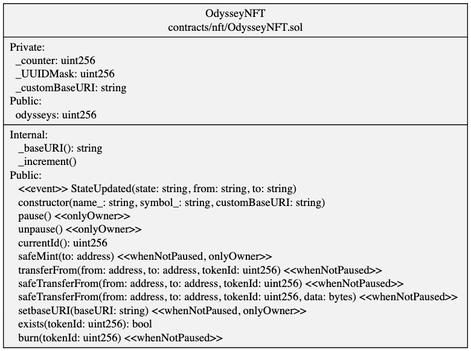
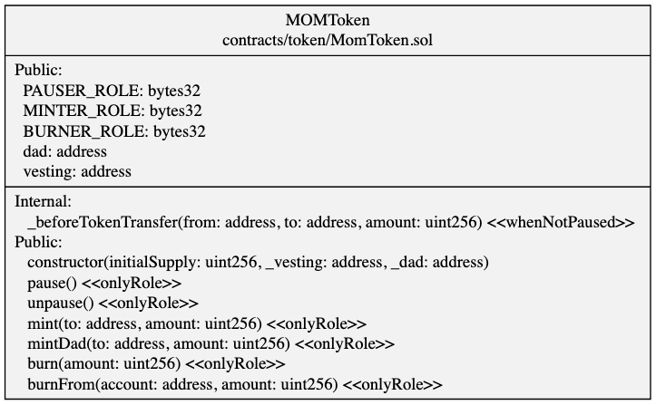
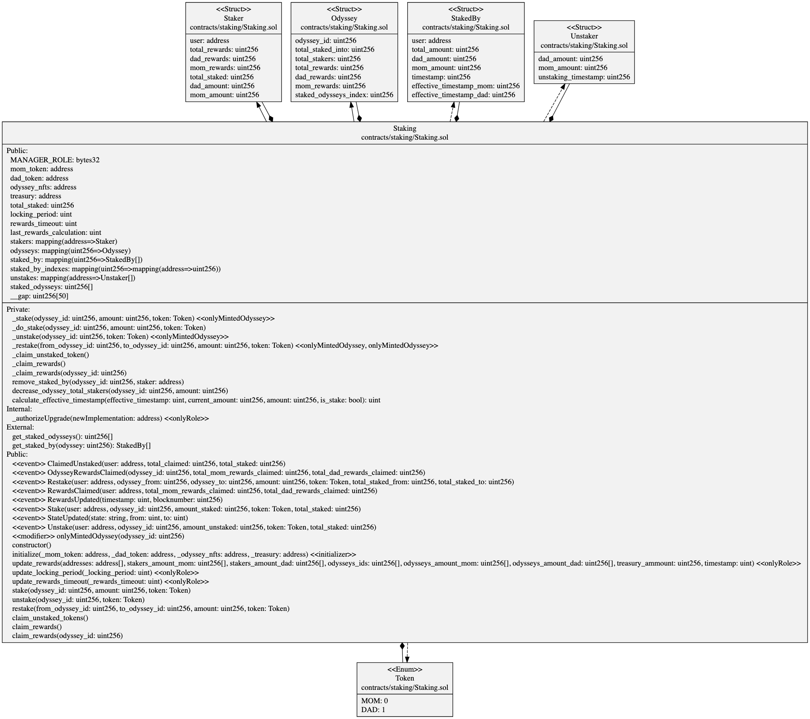

# Table of Contents
* [Odyssey 🐇](##-odyssey)
* [The Odyssey NFT 🌍](##-the-odyssey-nft)
    * [Description](##-staking)
    * [UML Class Diagram](##-uml-class-diagram)
    * [Roles](##-roles)
        * [Owner](##-owner)
* [MOM Token 🪙](##-the-odyssey-nft)
    * [Description](##-staking)
    * [UML Class Diagram](##-uml-class-diagram)
    * [Roles](##-roles)
        * [Pauser](##-pauser)
        * [Minter](##-minter)
        * [Burner](##-burner)
* [DAD Token 🪙](##-the-odyssey-nft)
    * [Description](##-staking)
    * [UML Class Diagram](##-uml-class-diagram)
    * [Roles](##-roles)
        * [Burner](##-burner)
        * [Transfer](##-transfer)
* [Staking 💰](##-the-odyssey-nft)
    * [Description](##-staking)
    * [UML Class Diagram](##-uml-class-diagram)
    * [Roles](##-roles)
        * [Manager](##-manager)
---
# Odyssey
Odyssey is your very own 3D world that serves as a visual representation of your personal expresion, existing in an universe.
The Odyssey Smart contracts enables you to be part of that universe, in a decentralised manner.

## The Odyssey NFT
The Odyssey NFTs is the starting point of your journey. With one Odyssey NFT, you are able to have your own Odyssey 3D world in our universe.
This NFT enables you to have acces to our own 3D World Builder.
Without an Odyssey NFT, you are still able to interact with other Odysseys and the universe, but you will not have your own.
It's a ERC721 token that will have a maximum number, still to be defined, that will be sold in a "Dutch auction".

### Description
ERC721 NFT token. A max tokens number can be set, along with a max number of tokens per wallet.

### UML Class Diagram

### Roles
All roles are set to the Deployer of the contract, at first
#### Owner
The deployer of the contract. Can change the private settings and pause/unpause the contract.

---

## The Momentum (MOM) Token
ERC20 MOM token is the fuel of the Momentum Universe. With MOM tokens you can create connection (Stake) with other Odysseys, and support the creators you love by increasing their rewards, and earning a share of it.

### Description
Standard ERC20 Token but with AccessControl. Ideally when deployed it will mint a certain amount of tokens to the Deployer.

### UML Class Diagram

### Roles
All roles are set to the Deployer of the contract, at first

#### Pauser
Can pause and unpause the contract.

#### Minter
Can mint  new tokens.

#### Burner
Can Burn tokens.

---

## The DAD Token
The ERC20 DAD token is a token that will be shared with early investors and the team, that can be burned for MOM tokens in the future, gradually, with a vesting period of 3 years. (Contract still to be done).

The DAD tokens can be staked, but never transfered.

### Description
ERC20 token with access control. No tokens will be minted on deploy and requires special access to transfer the tokens.

### UML Class Diagram

### Roles
All roles are set to the Deployer of the contract, at first

#### Burner
Can burn tokens.

#### Transfer
Is allowed to transfer tokens. The design was made in such a way that the DAD tokens cannot be transfered by default, only the account with Transfer role is allowed to.
This role is designed for the Staking contract, so the contract can transfer DADs to it and back to the owners.

---

## Staking
Staking is the core feature of Odyssey's Momentum. You can stake in Odysseys using the MOM token, and earn rewards. If you have an Odyssey that's been staked into, you will earn rewards as well.
The staking enables you to create connections, support creators and receive support from others.
The contract holds all staked tokens.
If you want to unstake from an Odyssey, there is a (initial) cooldown period of 7 days, then you can claim the untaked tokens.
You can Restake your tokens from an Odyssey to another one, this process doesn't have a cooldown period.
All the rewards are paid using new minted tokens, according to the inflation and staking rate. (Please, consult the Litepaper for the technical details)

### Description
The Staking contract allows addresses to stake in Odysseys. All the funds are kept by the contract and can be reclaimed by the users when unstaking.
A trusted third party calculate the rewards and updates the structures.

### UML Class Diagram

### Roles
All roles are set to the Deployer of the contract, at first
#### Manager
The role that is able to change the internal properties of the contract and update the rewards.
Since the update of the rewards are made externally of the contract, we need a trsuted party to update the values.
